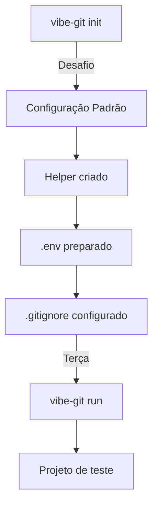

# 📋 Estrutura do Projeto - Vibe Git

Guia completo sobre a estrutura, configuração e desenvolvimento do projeto Vibe Git.

---

## 🎯 Conceitos Principais Abordados

Este projeto cobre os seguintes tópicos:

- ✅ **Conceitos do GitHub** - Controle de versão distribuído
- ✅ **Objetos e Arrays** - Estruturas de dados fundamentais
- ✅ **Instalação de Bibliotecas** - JavaScript (npm) e Python (pip)
- ✅ **Acessar Diretórios** - Export vs Export Default
- ✅ **Gitignore e .env** - Segurança e configuração
- ✅ **CLI Development** - Criar ferramentas de linha de comando

---

## 📅 Cronograma das Aulas

### Segunda-feira
Começamos com:
- Introdução ao projeto
- Setup inicial
- Finaliza com: **`vibe-git init`** (apenas inicialização, sem execução)

### Terça-feira
Continuamos com:
- Execução: **`vibe-git run`**
- Criação de um projeto de teste
- Testes práticos

---

## 📦 Package.json

Configuração do projeto Node.js:

```json
{
  "name": "curso-cli",
  "version": "1.0.0",
  "description": "",
  "main": "index.js",
  "bin": {
    "curso-cli": "./bin/cli.js"
  },
  "type": "module",
  "scripts": {
    "test": "echo \"Error: no test specified\" && exit 1"
  },
  "keywords": [],
  "author": "",
  "license": "ISC",
  "dependencies": {
    "dotenv": "^17.4.2"
  }
}
```

### Explicação dos campos

| Campo | Função |
|-------|--------|
| `name` | Nome do projeto |
| `version` | Versão do projeto |
| `main` | Arquivo principal |
| `bin` | Define comandos CLI executáveis |
| `type: "module"` | Usa ES6 modules (import/export) |
| `dependencies` | Bibliotecas externas necessárias |

---

## 🎮 Comando: vibe-git init

### Como chamar

```bash
npm run init
# ou
node bin/cli.js init
```

### ⚡ Desafio antes de executar

**Antes de inicializar o projeto, há um desafio:**

Implemente uma função que:
- Recebe um número como parâmetro
- Realiza uma operação (ex: 2 + 2)
- Retorna o resultado

```javascript
function desafio(numero) {
  return numero + 2;
}

console.log(desafio(2)); // esperado: 4
```

### O que o init faz

1. Cria o arquivo `vibe-git.config.json`
2. Configura valores padrão
3. Prepara o ambiente

---

## 🛠️ Helper

### Arquivo: `helper.js`

Cria um helper simples que retorna uma mensagem:

```javascript
export function help() {
  return "Não tem ajuda";
}
```

### Uso

```javascript
import { help } from "./helper.js";

console.log(help()); // "Não tem ajuda"
```

---

## ⚙️ Configuração Padrão (Default Config)

### Arquivo: `vibe-git.config.json`

```javascript
const CONFIG_FILE = "vibe-git.config.json";

const DEFAULT_CONFIG = {
  aiProvider: "gemini",
  modelName: "gemini-2.5-flash",
  createPR: true,
  prTemplate: "# Summary\nExplain what changed.\n\n# Testing\nExplain how this was tested."
};

const DEFAULT_ENTRY = {
  branchName: "feature-auth",
  userSummary: [
    "Criei a tela de login",
    "Adicionei validação de formulário",
    "Ajustei a chamada para a API de autenticação"
  ]
};
```

### Campos

**DEFAULT_CONFIG:**
- `aiProvider`: Provedor de IA (Gemini, OpenAI, Groq)
- `modelName`: Modelo específico a usar
- `createPR`: Se deve criar Pull Request automaticamente
- `prTemplate`: Template padrão para PRs

**DEFAULT_ENTRY:**
- `branchName`: Nome da branch padrão
- `userSummary`: Descrição das mudanças realizadas

---

## 📝 Logger com Chalk

### Arquivo: `logger.js`

Sistema de logs colorido e intuitivo:

```javascript
import chalk from "chalk";

const logger = {
  success(message) {
    console.log(chalk.green(`✔ ${message}`));
  },

  error(message) {
    console.error(chalk.red(`✖ ${message}`));
  },

  warn(message) {
    console.warn(chalk.yellow(`⚠ ${message}`));
  },

  info(message) {
    console.log(chalk.cyan(`ℹ ${message}`));
  },
};

export default logger;
```

### Uso

```javascript
import logger from "./logger.js";

logger.success("Arquivo criado com sucesso!");
logger.error("Erro ao ler arquivo");
logger.warn("Atenção: recurso experimental");
logger.info("Informação importante");
```

---

## 📂 Funções de Manipulação de Arquivos

### 1️⃣ fileExists

Verifica se um arquivo existe:

```javascript
async function fileExists(filePath) {
  try {
    await fs.access(filePath);
    return true;
  } catch {
    return false;
  }
}
```

**Uso:**
```javascript
const existe = await fileExists(".env");
console.log(existe); // true ou false
```

---

### 2️⃣ writeJson

Escreve dados JSON em um arquivo:

```javascript
async function writeJson(filePath, data) {
  const content = JSON.stringify(data, null, 2);
  await fs.writeFile(filePath, content, "utf-8");
}
```

**Uso:**
```javascript
const config = { nome: "Vibe Git", versão: "1.0.0" };
await writeJson("config.json", config);
```

---

### 3️⃣ addLinesToFile

Adiciona linhas a um arquivo sem duplicar:

```javascript
async function addLinesToFile(filePath, lines) {
  let currentContent = "";

  if (await fileExists(filePath)) {
    currentContent = await fs.readFile(filePath, "utf-8");
  }

  const currentLines = currentContent.split("\n");

  const linesToAdd = lines.filter(line => {
    return !currentLines.includes(line);
  });

  if (linesToAdd.length === 0) {
    return;
  }

  const prefix = currentContent.endsWith("\n") || currentContent.length === 0
    ? ""
    : "\n";

  await fs.appendFile(filePath, prefix + linesToAdd.join("\n") + "\n");
}
```

**Uso:**
```javascript
await addLinesToFile(".env", [
  "VIBE_GIT_AI_API_KEY=",
  "GEMINI_API_KEY=",
  "OPENAI_API_KEY=",
  "GROQ_API_KEY="
]);

await addLinesToFile(".gitignore", [
  "vibe-git/",
  ".env"
]);
```

---

## 🔐 Variáveis de Ambiente (.env)

### Arquivo: `.env`

Armazena chaves de API e configurações sensíveis:

```bash
VIBE_GIT_AI_API_KEY=
GEMINI_API_KEY=
OPENAI_API_KEY=
GROQ_API_KEY=
```

### ⚠️ Segurança

**Nunca commit este arquivo!** Use `.gitignore`.

Para usar em código:
```javascript
import dotenv from "dotenv";

dotenv.config();

const apiKey = process.env.GEMINI_API_KEY;
```

---

## 🚫 Gitignore

### Arquivo: `.gitignore`

Define quais arquivos não devem ser commitados:

```
vibe-git/
.env
node_modules/
.DS_Store
*.log
```

### Campos principais

| Padrão | Função |
|--------|--------|
| `.env` | Ignora arquivo de variáveis de ambiente |
| `vibe-git/` | Ignora diretório do projeto |
| `node_modules/` | Ignora dependências instaladas |
| `.DS_Store` | Ignora arquivos do macOS |
| `*.log` | Ignora arquivos de log |

---

## 📚 Fluxo de Desenvolvimento



---

## 🎓 Resumo Rápido

| Conceito | Descrição |
|----------|-----------|
| **Logger** | Sistema de logs colorido com chalk |
| **Config** | Arquivo de configuração padrão JSON |
| **Helper** | Funções auxiliares simples |
| **.env** | Variáveis de ambiente (NÃO commitar) |
| **.gitignore** | Define o que não commitar |
| **CLI** | Ferramenta de linha de comando |

---

## 🚀 Próximos passos

1. ✅ Implementar o desafio
2. ✅ Criar o helper
3. ✅ Configurar logger
4. ✅ Inicializar projeto
5. ✅ Testar comandos
6. ✅ Segunda-feira: vibe-git init
7. ✅ Terça-feira: vibe-git run

---

**Boa sorte com o projeto! 🎉**
